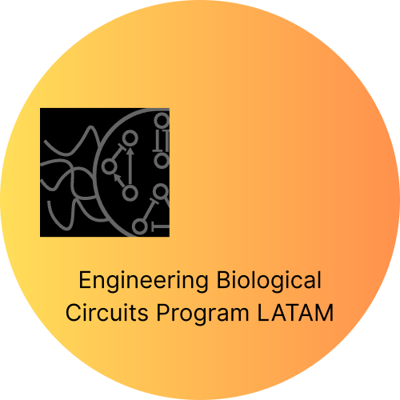

# EBCP LATAM 2025

<div align="center">
  
  
  [](https://polarbio.github.io/wsynbio-2025/)
  [](LICENSE)

</div>

---

## Acerca del sitio web

**Lectures EBCP LATAM 2025** es una plataforma web interactiva que contiene materiales de preparación para el workshop de **Biología Sintética** organizado por el laboratorio del Dr.Christian Cuba Samaniego. 

Este sitio web ofrece contenido teórico, simulaciones interactivas y ejemplos prácticos para dominar el diseño de circuitos en biología sintética, dirigido a investigadores, estudiantes y profesionales de América Latina.

## Ver el Sitio Web

👉 **[polarbio.github.io/EBCP-2025](https://polarbio.github.io/EBCP-2025/)**

## Desarrollo Local

Si quieres ejecutar el sitio localmente para desarrollo:
                         
### Prerrequisitos
- Python 3.x (para servidor local)
- Git

### Instalación

1. **Clona el repositorio:**
```bash
git clone https://github.com/polarbio/wsynbio-2025.git
cd wsynbio-2025