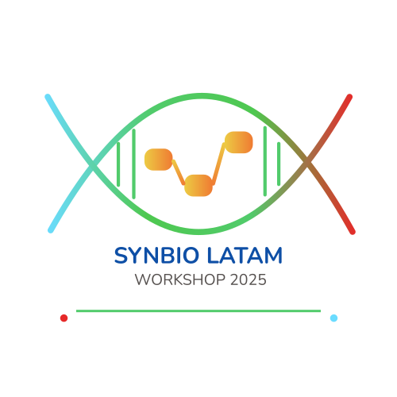

# 🧬 SynBio LatAm 2025 - Workshop Lecture Notes

<div align="center">
  
  
  [](https://polarbio.github.io/wsynbio-2025/)
  [](LICENSE)

</div>

---

## 📋 Descripción

**SynBio LatAm 2025** es una plataforma web interactiva que contiene materiales de preparación para el workshop de **Circuitos Biológicos** en Biología Sintética. 

Este sitio web ofrece contenido teórico, simulaciones interactivas y ejemplos prácticos para dominar el diseño de circuitos en biología sintética, dirigido a investigadores, estudiantes y profesionales de América Latina.

## 🌟 Características

- **📚 Contenido Educativo Estructurado**: Materiales organizados por niveles (Básico, Intermedio, Avanzado, Práctico)
- **🔍 Búsqueda y Filtrado**: Sistema de búsqueda inteligente para encontrar contenido específico
- **📱 Diseño Responsivo**: Optimizado para dispositivos móviles y desktop
- **🎨 Interfaz Moderna**: Diseño limpio con gradientes y animaciones suaves
- **🚀 Carga Rápida**: Optimizado para rendimiento web

## 📖 Contenido del Workshop

### 🔬 Módulos Disponibles

1. **Fundamentos de Circuitos Bistables**
   - Sistemas con dos estados estables
   - Toggle switches biológicos
   - Aplicaciones prácticas

2. **Sistemas Multiestables**
   - Circuitos con múltiples puntos de equilibrio
   - Diseño de memorias biológicas
   - Análisis de estabilidad

3. **Circuitos Oscilatorios**
   - Relojes biológicos
   - Sistemas periódicos
   - Control temporal en células

4. **Aplicaciones Prácticas**
   - Casos de uso reales
   - Implementación en laboratorio
   - Troubleshooting común

## 🚀 Ver el Sitio Web

👉 **[polarbio.github.io/wsynbio-2025](https://polarbio.github.io/wsynbio-2025/)**

## 🛠️ Desarrollo Local

Si quieres ejecutar el sitio localmente para desarrollo:

### Prerrequisitos
- Python 3.x (para servidor local)
- Git

### Instalación

1. **Clona el repositorio:**
```bash
git clone https://github.com/polarbio/wsynbio-2025.git
cd wsynbio-2025